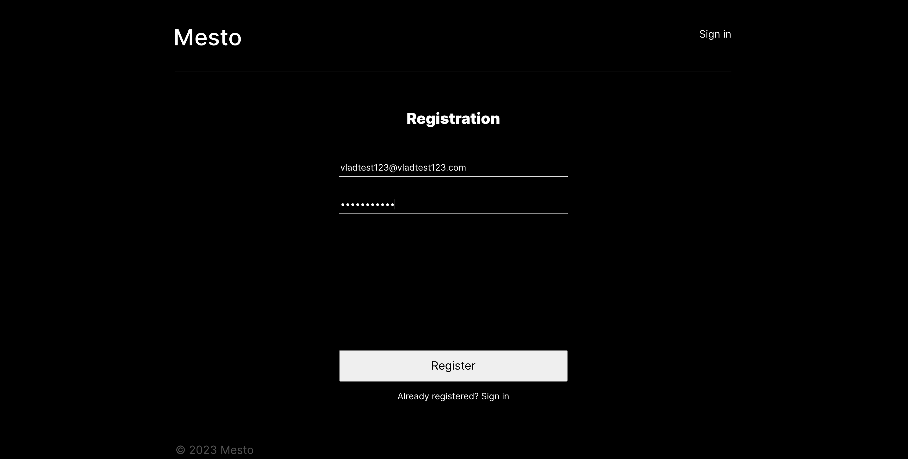
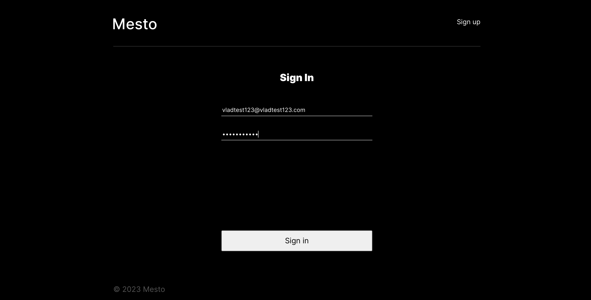
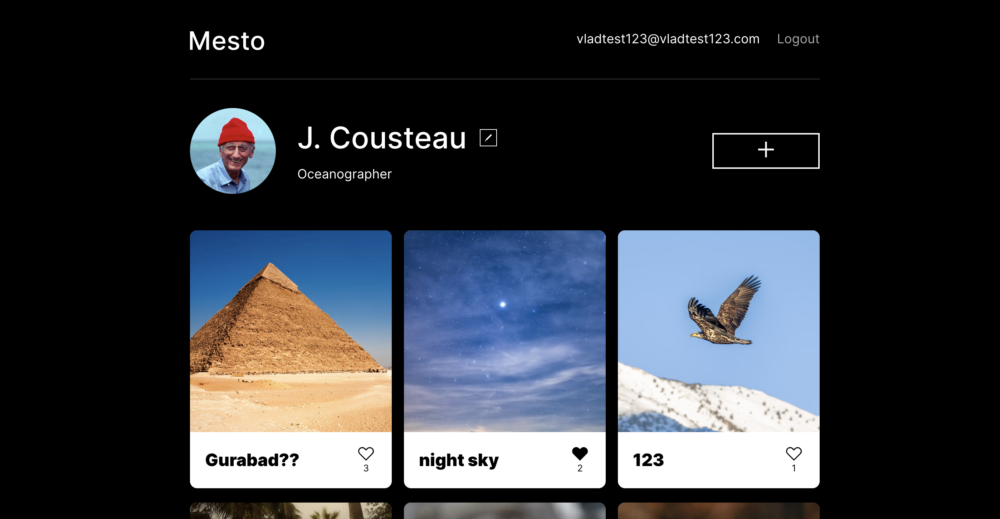
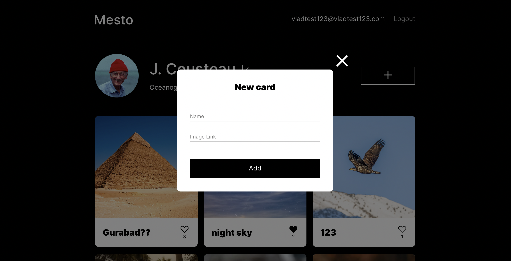
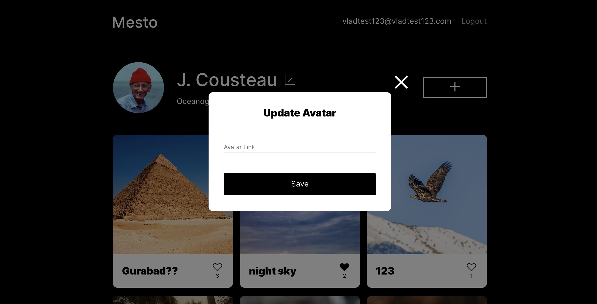
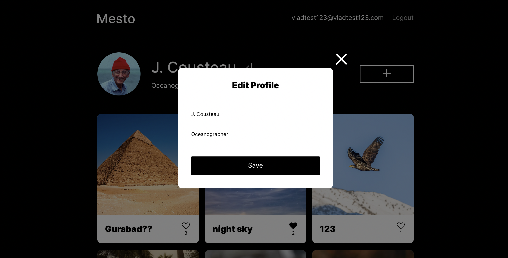

# Mesto Project (Front-end and Back-end)

This is a one-page application project completed during a web development course.  
The application allows users to create cards, which include a name, image, a like button, and a likes counter. The back-end component features several endpoints for saving, liking, and deleting cards, as well as user registration, login, logout, and profile or avatar editing.

* To run locally see [instructions](#run-locally) below.

Deployment links:
* Frontend https://mesto.nomoredomains.monster/
* Backend https://api.mesto.nomoredomains.monster/

## Preview 
* To add new cards and view cards added by others, users need to sign up or sign in first:
  

* After successfully signing in, users are redirected to the main page, where they can browse existing cards, add or remove likes:
 

* To add a new card (plus botton) or edit user information (avatar click, pencil-like button click), a few popups are available:
  
  

## Run locally

__Note:__ To run back-end locally, you need to have MongoDB installed and running on your system.
To install and run MongoDB community edition refer to the [official documentation](https://www.mongodb.com/docs/manual/tutorial/install-mongodb-on-os-x/).

1. Clone repository.
2. Install dependencies via the terminal:
    * while in /backend directory, run `$ npm i` for back-end dependencies
    * while in /frontend directory, run `$ npm i` for front-end dependencies
3. Launch the server and client via the terminal:
    * while in /backend directory, run `$ npm run start` (or `$ npm run dev` for hot-reload)  
    * while in /frontend directory, run `$ npm run start`  
    Both the front-end and back-end are set to run at port 3000; accept when prompted to run on another port.

